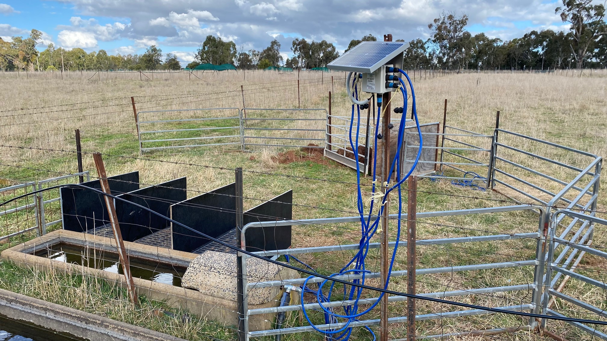

# ag-node

## Description

The ag-node is an automatic multi-weigh-station for measuring the live-weight of sheep  in remote locations. The station can be situated against a trough for which sheep weights will be recorded as they access feed or water. An in-built LoRaWAN radio sends data (containing live-weight information) back to a local gateway and onto the end user. Additional interfaces are provided, including; SDI-12, I2C and OneWire to allow for various sensors to be connected to the device (such as trough level sensors, temperature monitors etc.).

## Documentation

Firmware documentation can be found at [https://dpiclimate.github.io/ag-node](https://dpiclimate.github.io/ag-node)

## License
Ag-node is MIT licensed, as found in the [LICENSE](https://github.com/DPIclimate/ag-node/blob/master/LICENSE) file.
