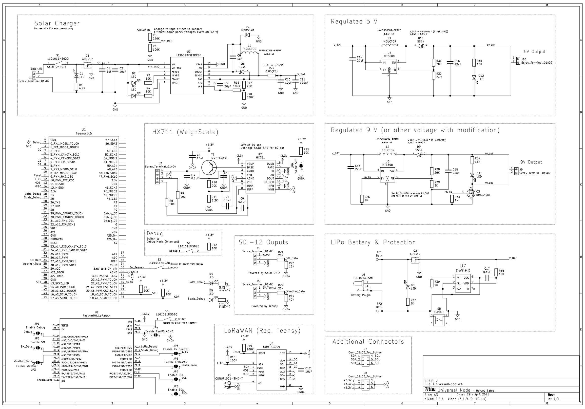

# Universal Node for LoRaWAN Devices

## Description
This universal node gives users the ability to adapt either a FeatherM0 (LoRaWAN) or a Teensy 3.6 microcontroller to a range of environmental sensors. The device aims to make it easier to setup and debug LoRaWAN nodes and to speed up the deployment of new sensors by integrating them into existing devices.

## Features
- Solar charger:
	- Fault and charging LED indicators
	- Reverse polarity protection
	- Adjustable solar input voltages
	- ON/OFF switch to shut-off system
	- Adjustable current output
- Regulated outputs:
	- 5 volt:
		- Always on when battery or solar connected
		- LED indicator (desolder for low-power mode)
	- 9 volt:
		- Programatically enabled (allowing shut-off when not in use)
		- Adjustable output (9 - 12 V)
		- LED indicator
- Battery:
	- 3 x 18650
	- Barrel jack input (4.2 V)
	- Reverse polarity protection
	- On PCB test points
	- Protection:
		- Push button switch to activate protection
		- Over-discharge/charge
- Weigh scale amplifier (HX711)
	- Screw terminal input
	- Adjustable frequency (10 Hz default, 80 Hz with jumper cut)
- SDI-12 inputs:
	- Weather station (5 V always on)
	- Soil moisture probe (9 V can turn off)
- LoRaWAN external module (Teensy)
- Onboard SD card storage (Teensy)
- Power / data line isolation between devices (solder bridges and manual switches)
- Debug mode switch

## Schematic
</img>

